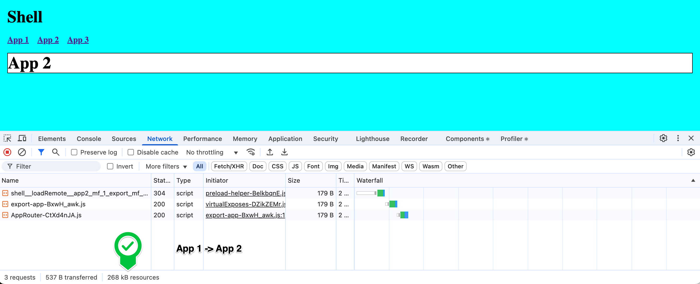
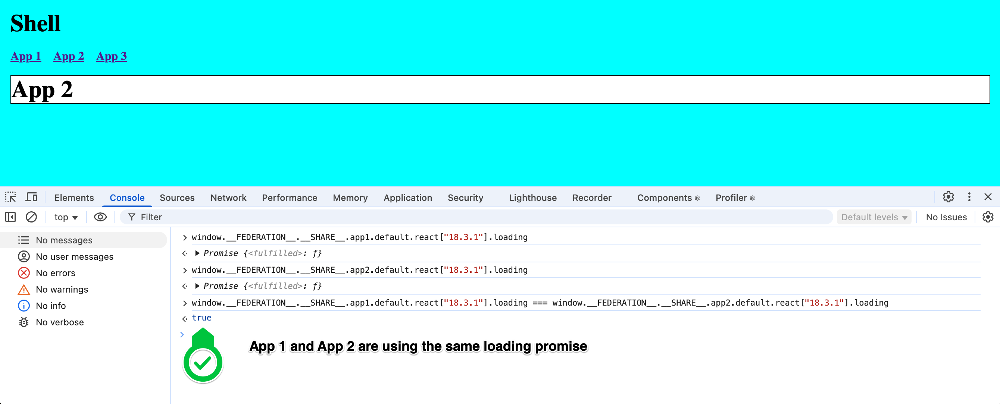
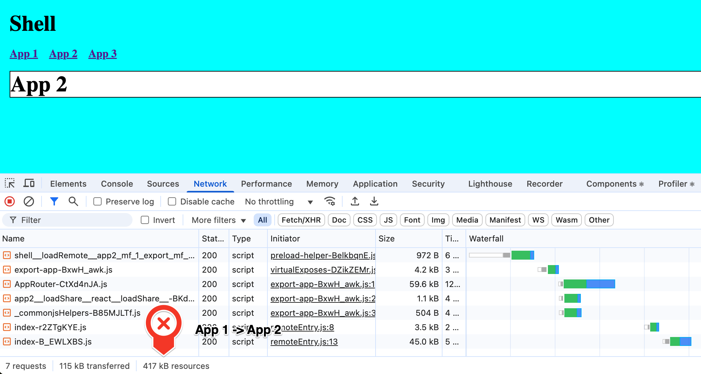
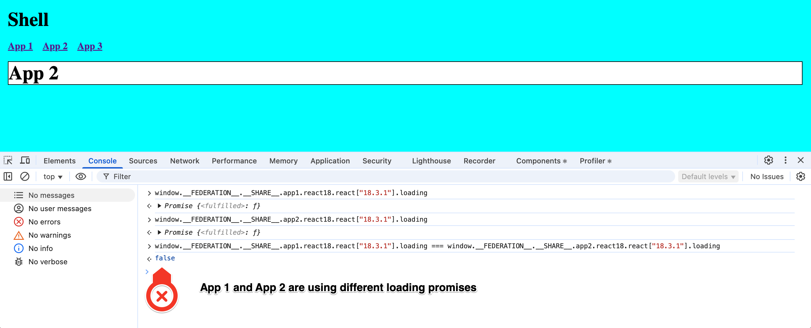

# Scoped Dependencies Example

This repository demonstrates that remote apps with the same scoped dependencies do not share the same instance of the dependency.

## Project Structure

The repository contains multiple applications, each with its own set of dependencies:

- `shell`
- `app-1` (React 18)
- `app-2` (React 18)
- `app-3` (React 17)

## Shared Dependencies

There are two sets of shared dependencies, separated by scopes:

### React 18 scope
This scope is used by `app-1` and `app-2`
```json
{
  react: {
    singleton: true,
    requiredVersion: "^18.3.0",
    shareScope: "react18",
  },
  "react-dom": {
    singleton: true,
    requiredVersion: "^18.3.0",
    shareScope: "react18",
  },
}
```

### React 17 scope
This scope is used by `app-3`
```json
{
  react: {
    singleton: true,
    requiredVersion: "^17.0.2",
    shareScope: "react17",
  },
  "react-dom": {
    singleton: true,
    requiredVersion: "^17.0.2",
    shareScope: "react17",
  },
}
```

## The Problem

When a shared dependency is scoped, it is not shared between apps that use the same scope. Let's compare navigation from App A to App B.

## shared React + React DOM dependencies (no scope) ✅

When navigating from `app-1` to `app-2`, three requests are made (in total 268 KB):


Both apps share the same loading promise of the React and React DOM dependencies:


## shared React 18 + React DOM 18 dependencies (with scope) ❌

When navigating from `app-1` to `app-2`, more requests are made and the amount of the transferred data is increased:


Both apps do not share the same loading promise:


## How to Run the Example Apps

### Install Dependencies

First, install the dependencies for all apps:

```sh
npm install
```

### Build the Apps

Build all apps:

```sh
npm run build
```

### Start the Apps

Start all apps:

```sh
npm run preview -w shell
npm run preview -w app-1
npm run preview -w app-2
npm run preview -w app-3
```